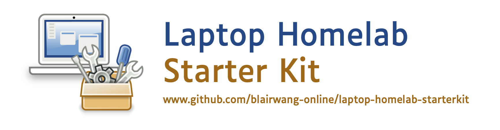

# laptop-homelab-starterkit

Starter kit for setting up lightweight virtual machines that can talk to each other, all from the comfort of your own laptop.

## Installation

- [Apple Silicon Mac (UTM on ARM) instructions](./docs/mac.md)
- [Windows (VirtualBox on x86-64) instructions](./docs/windows.md)

## Demonstrations

- [Kali Linux demo](./docs/kali-linux-demo.md)

&nbsp;

_Image source: GNOME Project, licensed under Creative Commons CC-BY-SA_
