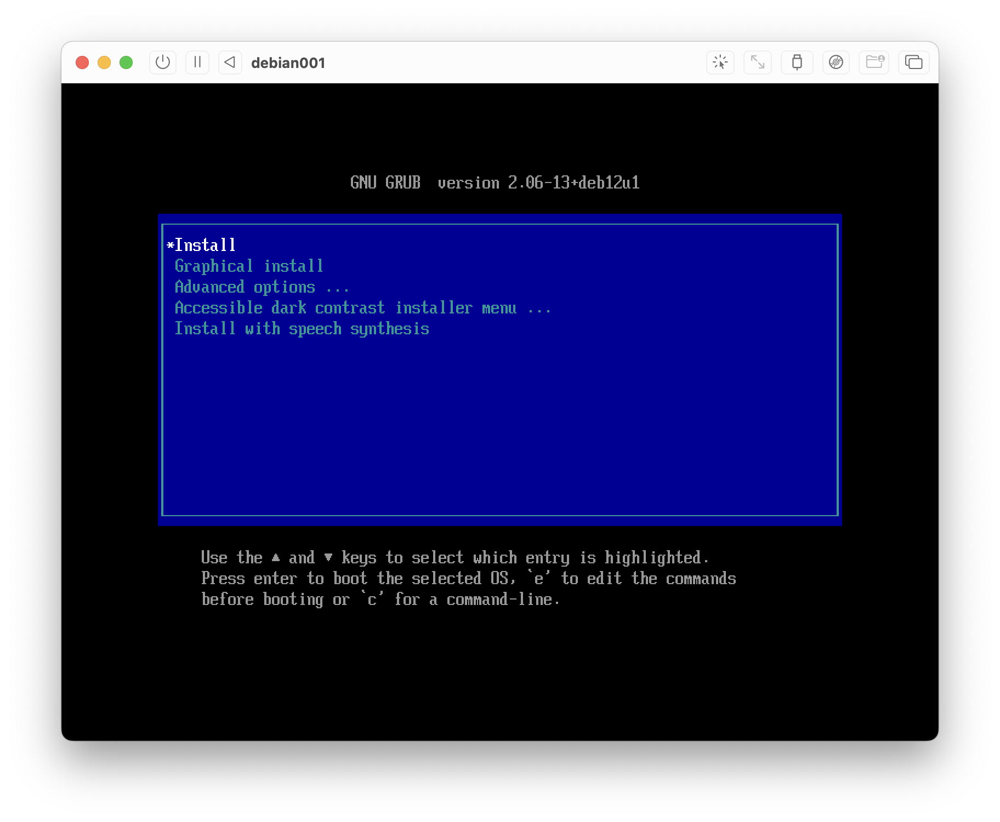
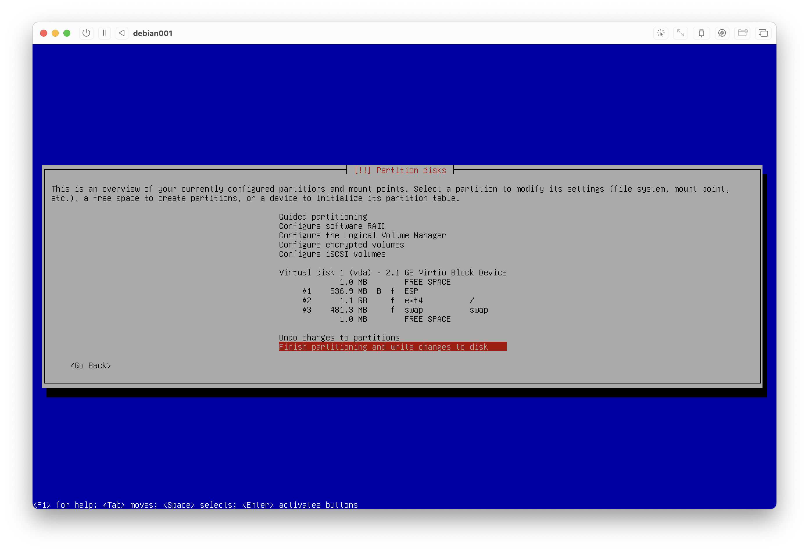
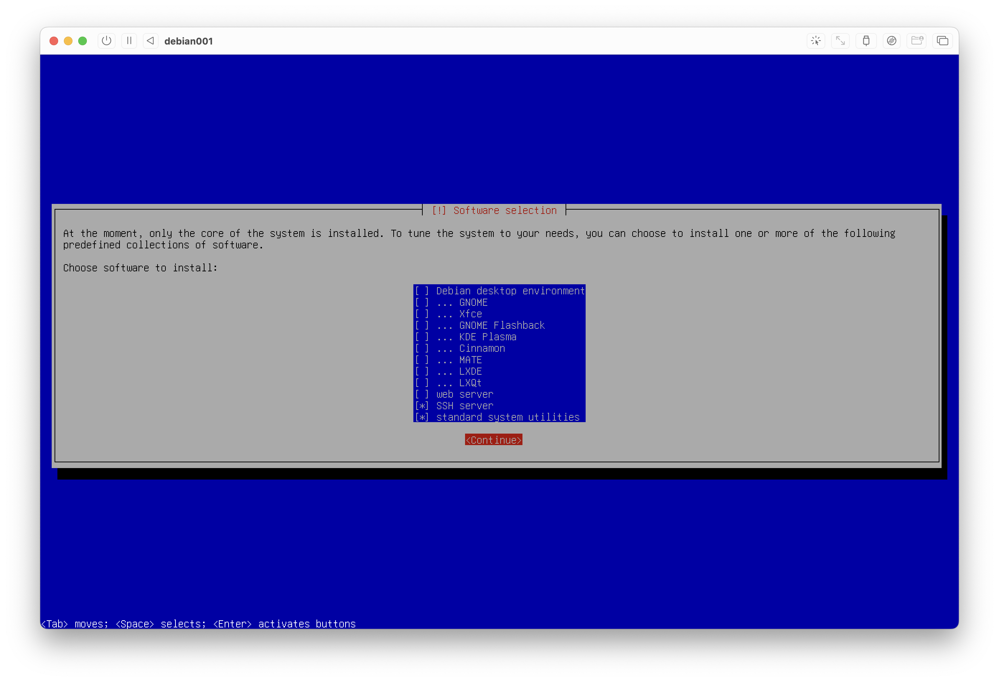
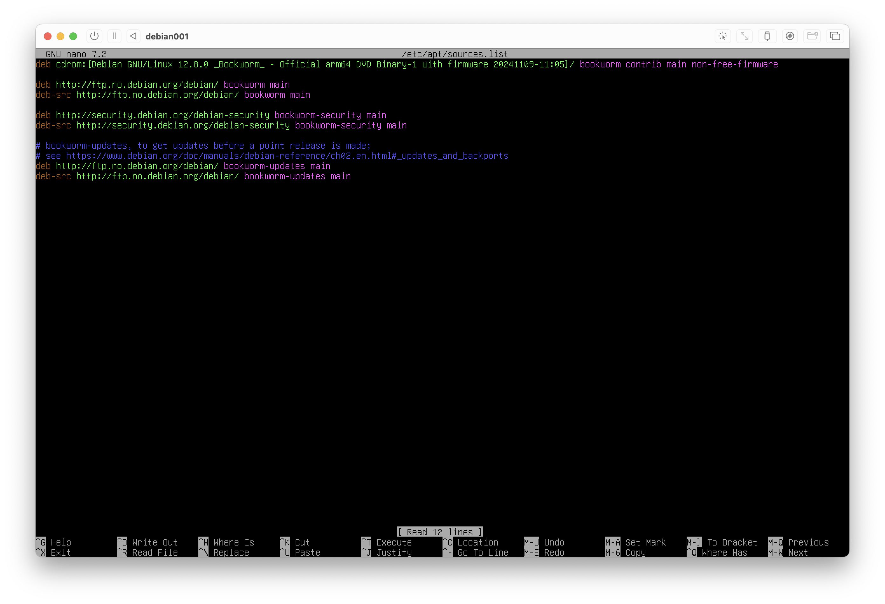
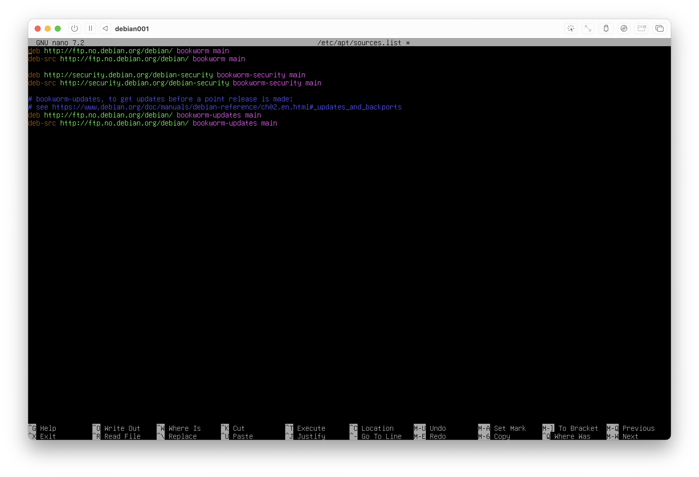
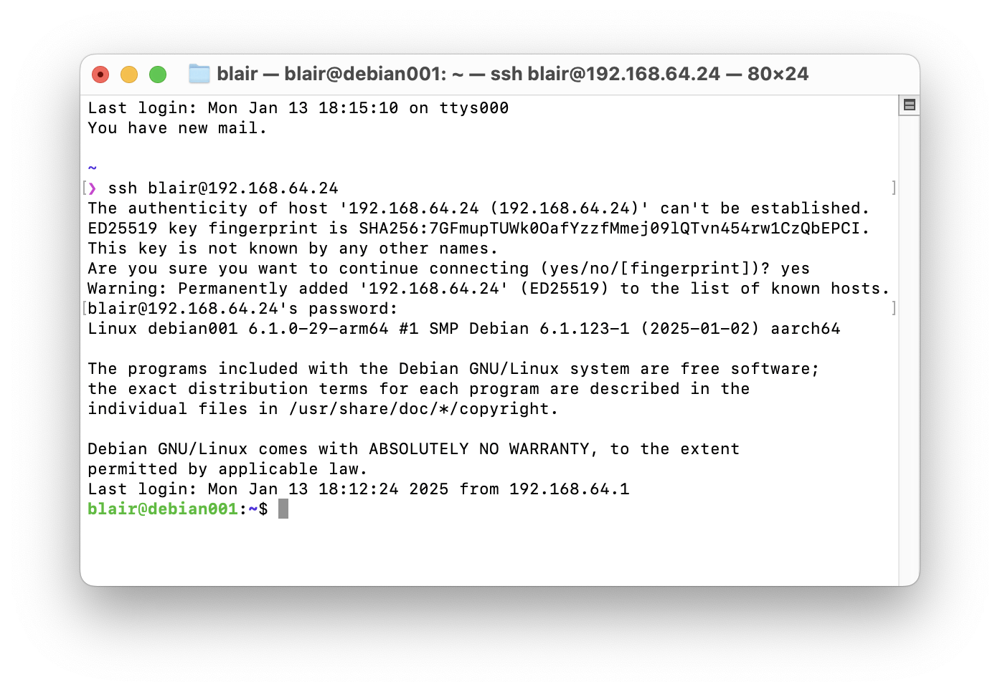

# Apple Silicon Mac (UTM on ARM) instructions for laptop-homelab-starterkit

Note: These instructions assume that you use an Apple Silicon Mac. If you are using an Intel Mac, then these instructions may not work.

Please also note that this is for testing purposes and not properly secured (by design). Do not put any confidential or sensitive data into the system that we set up here.

## Part 1. Setting up the host

1. Install UTM
	- Option 1. Go to https://mac.getutm.app/ and click **Download**. Open the downloaded DMG file and then drag the app to `/Applications/`
	- Option 2. Set up Homebrew (https://brew.sh/) and then run `brew install --cask utm`
		- There are ongoing debates about the security implications of Homebrew. [For example](https://security.stackexchange.com/questions/191364/what-are-the-security-implications-of-homebrew-and-macports) how Homebrew alters permissions on certain folders in order facilitate automated installations. Please take into consideration whether or not this is a risk in your case depending on who has access to your machine.
	- Option 3. Go to https://mac.getutm.app/ and click **Mac App Store**.
		- Note that this will cost money! You do _not_ need to use this option unless you want to.
		- As per the UTM website: _"The Mac App Store version is identical to the free version and there are no features left out of the free version. The only advantage of the Mac App Store version is that you can get automatic updates. Purchasing the App Store version directly funds the development of UTM and shows your support ."_

2. Download Debian
	- Go to https://cdimage.debian.org/cdimage/archive/12.8.0/arm64/iso-dvd/ and download the file whose filename `debian-12.8.0-arm64-DVD-1.iso`. It should be about 3.7G in size.

3. Open UTM and click **Create a New Virtual Machine**. Then, when prompted, click **Virtualize**, then click **Linux**.

4. When asked about Virtualization Engine and Boot Image Type, do not change the default settings. However, when asked about **Boot ISO Image**, navigate to and select the `iso` file from Step 2, then click **Continue**.

5. When asked about Hardware, assign 512 MiB of Memory, and 1 CPU core only. Do not "enable hardware OpenGL acceleration" as you do not need that. Then click **Continue**.

6. When asked about Storage, assign only 4 GiB of Storage. Then click **Continue**.

7. When asked about Shared Directory, do not set up any shared directories. Then click **Continue**.

8. On the summary page, give the virtual machine the name **debian001**. Then click **Save**.

&nbsp;

_Discussion questions:_

- Q1. Which option did you decide to take for Step 1 (Install UTM), and how did you make that decision?
- Q2. Step 1 refers to security implications of Homebrew. Explain the technical details of the concern about how Homebrew alters permissions on certain folders.
- Q3. It is important to verify the checksum of the `iso` file that we received. How can we do that? (Note: you may need to do some independent research about this.)
- Q4. What supply chain risks exist here, and what could we do to mitigate them?

## Part 2. Installing Debian

1. Start the virtual machine **debian001**. A new window will appear and soon it will look something like this:



2. This is a command-line interface, not a graphical user interface. Your mouse will not be able to interact with the installer. Use the arrow keys on your keyboard to navigate up and down the different options to try it out, but we actually want to use the default option called ***Install** (the first on the list). Select it and then hit <kbd>ENTER</kbd> on your keyboard.

3. Once you are in the Debian installer, the window will automatically resize itself. Please read the text in the bottom-left corner: _"&lt;Tab&gt; moves; &lt;Space&gt; selects; &lt;Enter&gt; activates buttons"_. Make sure that you do likewise for the remainder of the Debian installer.

4. For the language, select **English**. For the location, select **Ireland** (unless you are elsewhere?).

5. For the keyboard keymap, do a quick bit of research to find out what kind of keyboard you have. For example, my MacBook was purchased in Australia, which uses the **American English** keymap. This page may be helpful: https://support.apple.com/en-ie/102743

6. After the above steps, the installer will perform some tasks automatically, and then you will be asked to specify the hostname. Please use the hostname **debian001**. When asked about the domain name, though, just keep that blank.

7. When asked about the root password, just enter it as `password`. Yes, really! This is just a testing system as per the note at the top of this page.

8. When asked for the full name of the new user, enter your name in lowercase. For example I entered `blair`. Then confirm that this is the username of your account, and set your account to also have the password just as `password`.

9. When asked about partitioning disks, select the default **Guided - use entire disk**, and then allow it to use the default **Virtual disk 1 (vda) - 4.3 GB Virtio Block Device**. Then when prompted, accept the default setting **All files in one partition (recommended for new users)**.

10. When invited to, please confirm the partitioning plan:



11. When prompted to "write the changes to disk", select **&lt;Yes&gt;**.

12. When prompted to "scan extra installation media", select **&lt;No&gt;**.

13. When prompted to configure a network mirror, select **&lt;Yes&gt;**.
	- When I'm setting up a machine based in Australia, I select Australia and then `mirror.aarnet.edu.au`
	- When I'm setting up a machine based in Ireland, I select Norway and then `ftp.no.debian.org`
	- HTTP proxy is not required (unless you are 100% sure that it is)

14. Do not participate in the package usage survey.

15. When prompted to "choose software to install", keep the default selection of **SSH server** and **standard system utilities**.



16. Finally, the installation will finish and you will be asked to reboot. Select **&lt;Continue&gt;**.

17. When the virtual machine reboots, click the power button at the top-left corner of the screen (just to the right of the usual red/yellow/green window controls). You will be told: _"This may corrupt the VM and any unsaved changes will be lost. To quit safely, shut down from the guest."_ But click **OK** anyway and force the virtual machine to shut down.

18. In the main UTM window, select the **debian001** virtual machine, click on the dropdown labelled **CD/DVD** and then click **Clear**. This will prevent the virtual machine from running the Debian installer every time you boot it up.

&nbsp;

_Discussion questions:_

- Q5. The screenshot below Step 1 refers to "GNU GRUB". What is this? (Note: you may need to do some independent research about this.)
- Q6. The screenshot below Step 10 refers to `ext4` and `swap`. What are these, and what are the security implications of them?
- Q7. Step 13 refers to "mirrors". What are these?
- Q8. The screenshot below step 15 refers to various desktop environments. What are these?


## Part 3. Configuring Debian

1. Start up **debian001**. Once it boots up, you will be presented with a very plain and simple prompt:

	```
	Debian GNU/Linux 12 debian001 tty1
	
	debian001 login: _
	``` 

2. At this prompt, enter your username (whatever you used during setup, i.e., the lowercase version of your given name - for me I used `blair`). Then hit <kbd>ENTER</kbd>. Now your prompt looks like this:

	```
	Debian GNU/Linux 12 debian001 tty1
	
	debian001 login: blair
	Password: _
	``` 

3. Enter your password (if you followed the instructions so far, it is `password`). **The password will be completely invisible, you will not even see something like [&bull;&bull;&bull;&bull;&bull;&bull;&bull;&bull;], this is the correct and expected behaviour.** Just hit <kbd>ENTER</kbd> when you've typed your password.

4. Once you've logged in, you will see something like this:

	```
	Debian GNU/Linux 12 debian001 tty1
	
	debian001 login: blair
	Password: 
	Linux debian001 6.1.0-27-arm64 #1 SMP Debian 6.1.115-1 (2024-11-01) aarch64
	
	The programs included with the Debian GNU/Linux system are free software;
	the exact distribution terms for each program are described in the
	individual files in /usr/share/doc/w/copyright.
	
	Debian GNU/Linux comes with ABSOLUTELY NO WARRANTY, to the extent
	permitted by applicable law.
	blair@debian001:~$ _
	``` 

5. At this prompt, run `su -` and then enter the root password (if you followed the instructions so far, it is `password`). Now you should see something like this:

	```
	Debian GNU/Linux 12 debian001 tty1
	
	debian001 login: blair
	Password: 
	Linux debian001 6.1.0-27-arm64 #1 SMP Debian 6.1.115-1 (2024-11-01) aarch64
	
	The programs included with the Debian GNU/Linux system are free software;
	the exact distribution terms for each program are described in the
	individual files in /usr/share/doc/w/copyright.
	
	Debian GNU/Linux comes with ABSOLUTELY NO WARRANTY, to the extent
	permitted by applicable law.
	blair@debian001:~$ su -
	Password:
	root@debian001:~# _
	``` 
	
6. At this prompt, run `nano /etc/apt/sources.list`.
	- Please note that you will NOT be able to copy and paste this text into the virtual machine, so you will need to type it manually one letter at a time, sorry!
	- The purpose of this command is to detach the installer from the virtual machine completely, so that you are able to install new software into this virtual machine.
	- `nano` is a command-line text editor. `/etc/apt/sources.list` is a file in the virtual machine that configures the package manager.

7. Your screen will now become a little bit more colourful, as you enter `nano`, a command-line text editor:



8. With the cursor on the first line (which it is by default), hit <kbd>Ctrl</kbd>+<kbd>K</kbd> on your keyboard. Yes, that is **Ctrl** (on Mac keyboards, <kbd>control ^</kbd>); NOT "Command". You can see that this is the "Cut" shortcut if you look at the bottom of your virtual machine window. Now your screen looks like this:



9. If you were not able to successfully do this (e.g., if you had selected the wrong line, hit <kbd>Ctrl</kbd>+<kbd>X</kbd> and then type "n"). Now go back to step 6 and try steps 6 to 8 again. However, if you _were_ able to successfully do this, then hit <kbd>Ctrl</kbd>+<kbd>X</kbd> and then type "y". Then hit <kbd>ENTER</kbd>.
	- While you are inside `nano`, if you look at the bottom of your virtual machine window, you will see that Ctrl+X is the "Exit" shortcut.
	- Hint: at the prompt, if you use the up key on your keyboard, it will go back to previous commands.

10. Now, run `apt update -y && apt-upgrade -y`. Please note that you will NOT be able to copy and paste this text into the virtual machine, so you will need to type it manually one letter at a time, sorry! The output should look something like this (note that this is when there are no updates, if there are updates available then the output will look a little bit different):

	```
	root@debian001:~# apt update -y && apt upgrade -y
	Hit:1 http://ftp.no.debian.org/debian bookworm InRelease
	Hit:2 http://security.debian.org/debian-security bookworm-security InRelease
	Hit:3 http://ftp.no.debian.org/debian bookworm-updates InRelease
	Reading package lists... Done
	Building dependency tree... Done
	Reading state information... Done
	All packages are up to date.
	Reading package lists... Done
	Building dependency tree... Done
	Reading state information... Done
	Calculating upgrade... Done
	0 upgraded, 0 newly installed, 0 to remove and 0 not upgraded.
	root@debian001:~# _
	```

11. Now, run `apt install -y sudo`. The output should look something like this:

	```
	root@debian001:~# apt install -y sudo
	Reading package lists... Done
	Building dependency tree... Done
	Reading state information... Done
	The following NEW packages will be installed:
  	sudo
	0 upgraded, 1 newly installed, 0 to remove and 0 not upgraded.
	Need to get 1,826 kB of archives.
	After this operation, 6,511 kB of additional disk space will be used.
	Get:1 http://ftp.no.debian.org/dehian bookworm/main arm64 sudo arm64 1.9.13p3-1+deb12u1 ［1,826 KB］
	Fetched 1,826 kB in 1s (2,161 kB/s)
	Selecting previously unselected package sudo.
	(Reading database ... 38602 files and directories currently installed.)
	Preparing to unpack .../sudo_1.9.13p3-1+deb12u1_arm64.deb ...
	Unpacking sudo (1.9.15p3-1+deb1241) ...
	Setting up sudo (1.9.13p3-1+deb12u1) ...
	Processing triggers for man-db (2.11.2-2) ...
	Processing triggers for libc-bin (2.36-9+deb12u9) ...
	root@debian001:~# _
	```

12. At this prompt, type `export EDITOR=nano` and hit <kbd>ENTER</kbd>. Then run `visudo`.

13. Using your arrow keys on your keyboard, scroll down to the part of the file that looks like this:

	```
	# User privilege specification
	root    ALL=(ALL:ALL) ALL
	```

14. Add a new line in there for your own account name, e.g., for `blair`:


	```
	# User privilege specification
	root    ALL=(ALL:ALL) ALL
	blair   ALL=(ALL:ALL) ALL
	```

15. Use <kbd>Ctrl</kbd>+<kbd>X</kbd> to start exiting, then type "y" for "Yes" (to saving the file). Hit <kbd>ENTER</kbd> to confirm the suggested file location.

16. When back at the `root@debian001:~# _` prompt, type `exit`. This will return you back to your main (non-root) account, `blair@debian001:~$ _`.

17. Try to use `sudo`, for example, `sudo echo hi`. You will be prompted for your password; enter it as usual. If your output now looks something like this, then it means that `sudo` is now set up!

	```
	root@debian001:~# exit
	logout
	blair@debian001:~$ sudo echo hi
	[sudo] password for blair:
	hi
	blair@debian001:~$ _
	```

18. Congratulations, now you know how to set up Debian GNU/Linux virtual machines inside your Apple Silicon Mac! :)

&nbsp;

_Discussion questions:_

- Q9. Step 5 refers to `su -`. What is `su` and why is there a `-` after it?
- Q10. What is achieved by Step 10?
- Q11. Steps 11 to 17 set up a tool call `sudo`. What is `sudo` and how is it different to `su`?


## Part 4. Multiple VMs

1. In your virtual machine `debian001`, run the command `ip addr`. The output will look something like this:

	```
	blair@debian001:~$ ip addr
	1: lo: <LOOPBACK,UP,LOWER_UP> mtu 65536 qdisc noqueue state UNKNOWN group default qlen 1000
		link/loopback 00:00:00:00:00:00 brd 00:00:00:00:00:00
		inet 127.0.0.1/8 scope host lo
		   valid_lft forever preferred_lft forever
		inet6 ::1/128 scope host noprefixroute 
		   valid_lft forever preferred_lft forever
	2: enp0s1: <BROADCAST,MULTICAST,UP,LOWER_UP> mtu 1500 qdisc fq_codel state UP group default qlen 1000
		link/ether xx:xx:xx:xx:xx:xx brd ff:ff:ff:ff:ff:ff
		inet 192.168.64.24/24 brd 192.168.64.255 scope global dynamic enp0s1
		   valid_lft 78420sec preferred_lft 78420sec
		inet6 xxxx:xxxx:xxxx:xxxx:xxxx:xxxx:xxxx:xxxx/64 scope global dynamic mngtmpaddr 
		   valid_lft 2591928sec preferred_lft 604728sec
		inet6 xxxx::xxxx:0xx:xxxx:xxxx/64 scope link 
		   valid_lft forever preferred_lft forever
	```
	
2. We are looking for the local IP address, `192.168.xx.xx`.
	- Can you see it in the output above? In this case, it is `192.168.64.24`
	- If you are having difficulty seeing it, try running this instead: `ip addr | grep inet`
	- Or better yet: `ip addr | grep 192` (!)
	
3. On your Mac, open the app called **Terminal.app**. Once it loads, run the command: `ssh your_name@192.168.xx.xx`, **substituting your_name with your actual username in debian001, and 192.168.xx.xx with the actual IP address**. So for example, I will run the command:

	```
	ssh blair@192.168.64.24
	```

4. When prompted about the ED25519 key fingerprint, type "yes" and then hit <kbd>ENTER</kbd>. Then type the password from before (probably `password`!). Now you will be accessing the virtual machine through the native macOS terminal rather than through the UTM window!
	- From this point onwards, <kbd>Command</kbd>+<kbd>C</kbd> to copy and <kbd>Command</kbd>+<kbd>V</kbd> to paste will work, if you use the Mac Terminal.
	- The output looks something like this:



5. Now, we will create another VM called `debian002`. It will have essentially the same settings as `debian001`. To do this, complete Parts 2 and 3 with another new VM with the same settings. In fact, keep everything the same, but this time call it `debian002`.

6. Based on steps 1 and 2 above, deduce the IP addresses of both `debian001` and `debian002`

7. From `debian001`, ping `debian002` to confirm the two machines can talk to each other; for completeness, also try to ping in the other direction, from `debian002` to `debian001`.

&nbsp;

_Discussion questions:_

- Q12. Step 2 involves the use of pipes and grep. Explain how these work.
- Q13. Step 3 involves the use of SSH. What is SSH and why is it of significance in cybersecurity?
- Q14. What is the security notice in Step 4 about?
