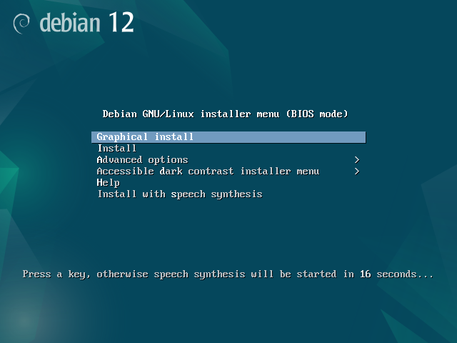
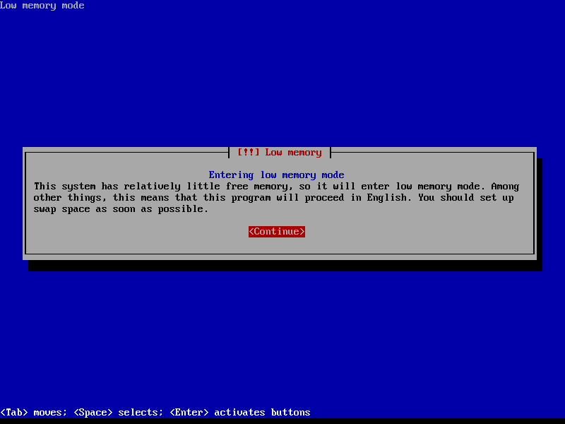
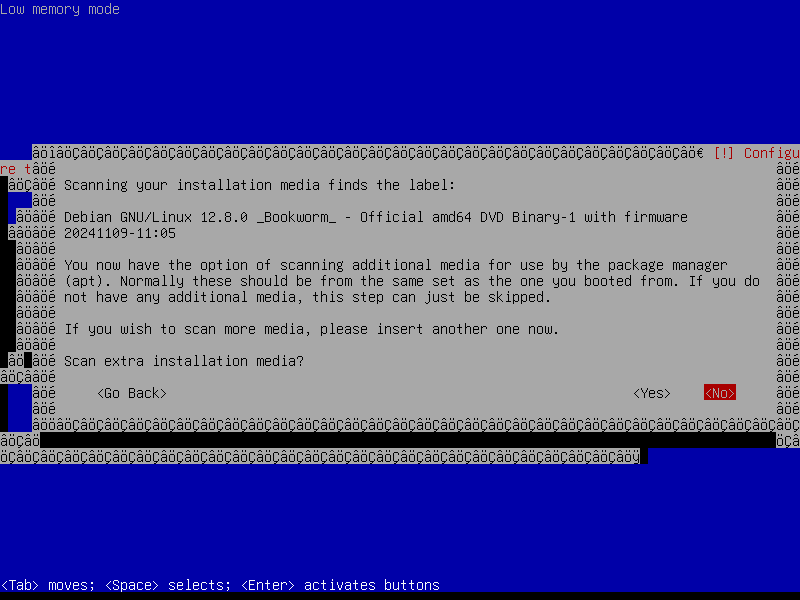
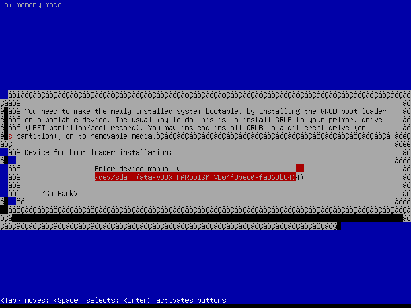

# Windows (VirtualBox on x86-64) instructions for laptop-homelab-starterkit

Note: These instructions assume that you have an x86-64 Windows computer (typical Intel or AMD processor). If you are using an ARM-based Windows computer, then these instructions may not work.

Please also note that this is for testing purposes and not properly secured (by design). Do not put any confidential or sensitive data into the system that we set up here.

## Part 1. Setting up the host

1. Install Oracle VirtualBox
	- Option 1. Go to https://www.virtualbox.org and download from there
	- Option 2. Set up Chocolatey and then run, from an administrative command prompt (cmd.exe), `choco install -y virtualbox`

2. Download Debian
	- Go to https://cdimage.debian.org/cdimage/archive/12.8.0/amd64/iso-dvd/ and download the file whose filename `debian-12.8.0-amd64-DVD-1.iso`. It should be about 3.7G in size.

3. Open VirtualBox and click **New**.
	- Name: `debian001`
	- ISO Image: select the file you obtained from step 2.
	- Enable **Skip Unattended Installation** - this is important!
	- Under **Hardware**, set base memory to 512 MB, and keep processors set to 1 as per default
	- Under **Hard Disk**, set the size of the hard disk to 4.00GB
	- Then click **Finish**

## Part 2. Installing Debian

1. Start the virtual machine **debian001**. A new window will appear and soon it will look something like this:



2. This is a command-line interface, not a graphical user interface. Your mouse will not be able to interact with the installer. Use the arrow keys on your keyboard to navigate up and down the different options to try it out, but we actually want to use the second option called **Install** (the **second** on the list; note, this is NOT the default "Graphical Install" option). Select it and then hit <kbd>ENTER</kbd> on your keyboard.

3. Once you are in the Debian installer, the window will automatically resize itself. You might get a "Low memory" warning; this is fine.



4. Please read the text in the bottom-left corner: _"&lt;Tab&gt; moves; &lt;Space&gt; selects; &lt;Enter&gt; activates buttons"_. Make sure that you do likewise for the remainder of the Debian installer.

5. Location: work through the menus on the screen. Keymap: do a quick bit of research to find out what kind of keyboard you have. The most common are "British" (also common in Ireland) and "American" (also common in Australia) layouts. This page may be helpful: https://en.wikipedia.org/wiki/British_and_American_keyboards

6. After the above steps, the installer will perform some tasks automatically, and then you will be asked to specify the hostname. Please use the hostname **debian001**. When asked about the domain name, though, just keep that blank.

7. When asked about the root password, just enter it as `password`. Yes, really! This is just a testing system as per the note at the top of this page.

8. When asked for the full name of the new user, enter your name in lowercase. For example I entered `blair`. Then confirm that this is the username of your account, and set your account to also have the password just as `password`.

9. When asked about partitioning disks, select the default **Guided - use entire disk**, and then allow it to use the default **SCSI3 (0,0,0) (sda) - 4.3 GB ATA VBOX HARDDISK**. Then when prompted, accept the default setting **All files in one partition (recommended for new users)**.

10. When invited to, please confirm the partitioning plan:


11. When prompted to "write the changes to disk", select **&lt;Yes&gt;**.

12. When prompted to "scan extra installation media", select **&lt;No&gt;**. Note that at this stage, you may find that the graphics get a little bit strange (see screenshot below); this is mildly annoying but it should not prevent you from proceeding with the installation.



13. When prompted to configure a network mirror, select **&lt;Yes&gt;**.
	- When I'm setting up a machine based in Australia, I select Australia and then `mirror.aarnet.edu.au`
	- When I'm setting up a machine based in Ireland, I select Norway and then `ftp.no.debian.org`
	- HTTP proxy is not required (unless you are 100% sure that it is)

14. Do not participate in the package usage survey.

15. When prompted to "choose software to install", keep the default selection of **SSH server** and **standard system utilities**.

16. If asked if you want to _"Install the GRUB boot loader to your primary drive?"_, select **&lt;Yes&gt;**. The _"Device for boot loader installation"_ should be `/dev/sda` as shown below:



17. Finally, the installation will finish and you will be asked to reboot. Select **&lt;Continue&gt;**.

## Part 3. Configuring Debian

When the virtual machine reboots, you can proceed to "Part 3. Configuring Debian" of the Mac instructions.

## Part 4. Multiple VMs

1. In your virtual machine `debian001`, run the command `ip addr`. The output will look something like this:

	```
	blair@debian001:~$ ip addr
	1: lo: <LOOPBACK,UP,LOWER_UP> mtu 65536 qdisc noqueue state UNKNOWN group default qlen 1000
		link/loopback 00:00:00:00:00:00 brd 00:00:00:00:00:00
		inet 127.0.0.1/8 scope host lo
		   valid_lft forever preferred_lft forever
		inet6 ::1/128 scope host noprefixroute 
		   valid_lft forever preferred_lft forever
	2: enp0s1: <BROADCAST,MULTICAST,UP,LOWER_UP> mtu 1500 qdisc fq_codel state UP group default qlen 1000
		link/ether xx:xx:xx:xx:xx:xx brd ff:ff:ff:ff:ff:ff
		inet 10.0.2.15/24 brd 10.0.2.255 scope global dynamic enp0s3
		   valid_lft 86209sec preferred_lft 86209sec
		inet6 xxxx:xxxx:xxxx:xxxx:xxxx:xxxx:xxxx:xxxx/64 scope global dynamic mngtmpaddr 
		   valid_lft 86209sec preferred_lft 14204sec
		inet6 xxxx::xxxx:0xx:xxxx:xxxx/64 scope link 
		   valid_lft forever preferred_lft forever
	```
	
2. We are looking for the local IP address, `10.0.xx.xx`.
	- Can you see it in the output above? In this case, it is `10.0.2.15`
	- If you are having difficulty seeing it, try running this instead: `ip addr | grep inet`

3. Now, we will create another VM called `debian002`. It will have essentially the same settings as `debian001`. To do this, complete Parts 2 and 3 with another new VM with the same settings. In fact, keep everything the same, but this time call it `debian002`.

4. Based on steps 1 and 2 above, deduce the IP addresses of both `debian001` and `debian002`

5. From `debian001`, ping `debian002` to confirm the two machines can talk to each other; for completeness, also try to ping in the other direction, from `debian002` to `debian001`.

